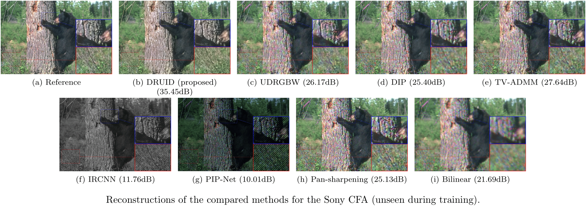

# Pattern-invariant Unrolling for Robust Demosaicking

This repository contains the implementation of the DRUID (Demosaicking with Robust UnrollIng Design) demosaicking method, presented in the paper the paper _Pattern-invariant Demosaicking Using a Deep Plug-and-Play Unrolled Algorithm_ submitted at to IEEE Transactions on Computational Imaging (TCI).

## Overview

To acquire color images, most commercially available cameras and low-cost image sensors use color filter arrays (CFAs), a pattern of color filters overlaid over the sensor's photodetectors.
Traditionally, demosaicking methods are tailored for specific CFAs, leading to poor performance when applied to other CFAs.

In this work, we present DRUID, an algorithm for demosaicking a wide variety of color filter arrays (CFAs) commonly used in commercial cameras.
To address this, we propose an unrolling algorithm based on an iterative variational algorithm that blends the knowledge of the CFA with a learned prior.
The method introduces a novel loss function using geometric transformations of CFA patterns to force the algorithm to learn CFA-independent a prior that is less dependent on the CFA patterns seen in training.
Experiments on several CFAs demonstrate the effectiveness of our method, matching the performance of methods tailored for specific CFAs and outperforming existing CFA-invariant methods.

## Installation

All the code runs in Python 3.10+ and relies on classical Python libraries (torch, matplotlib, ...).
The code is proposed in a Pytorch Lightning class for convenience in training, testing and predicting.
However, it is easily possible to get only the network which is written in pure Pytorch.
It is recommended to use a **virtual environment** to run the code.

```
git clone https://github.com/mattmull42/DRUID_demosaicking
cd unrolled_demosaicking
pip install -r requirements.txt
```

We provide in `weights` the trained parameters for the main DRUID method (ending with `4`); the weights for the training without the geometric transformations (ending with `NoGT`); and the weights for the training without the geometric transformations and the intermediate loss(ending with `NoGTLoss`).
In all cases the training was done on the same dataset (BSD500) with the same set of CFAs (Bayer, Chakrabarti, Gindele, Hamilton, Honda, Kaizu, Kodak, Quad-Bayer, Sony, Sparse3, Wang, Yamagami, Yamanaka) and with the same parameters.

To reproduce the results and use the proposed method in the paper the users need to use the weights ending with `4`.
Those weights come from the training with the invariance procedure enabled.
The other sets of weights are the ones used for the ablation study and do not work as well as the proposed weights.

## Training

The Python script `train.py` contains all the routine to train the network on a chosen set of CFAs.
It is highly recommended running additional trainings on a GPU. The best weights will be saved in the `weights` directory, in function of the names of the CFAs seen during the training. The suffix 'NoGT' is appended if the training is done without the geometric transformations.

## Testing

The notebook `test.ipynb` provides the tools to apply the network with the selected weights on a dataset with a given set of CFAs. It gives the mean PSNR (in dB) and SSIM, along with their corresponding standard variations.

## Predicting

The notebook `predict.ipynb` allows the users to apply the wanted weights to a specific image and retrieve its corresponding output with some utilities to present the results. The method is run on the chosen CFAs.

## Results




## Contact

For any questions please open an issue on this repository or contact us directly through our email addresses:

- matthieu.muller@gipsa-lab.fr
- daniele.picone@gipsa-lab.fr
- mauro.dalla-mura@gipsa-lab.fr
- mou@hi.is
